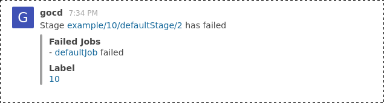
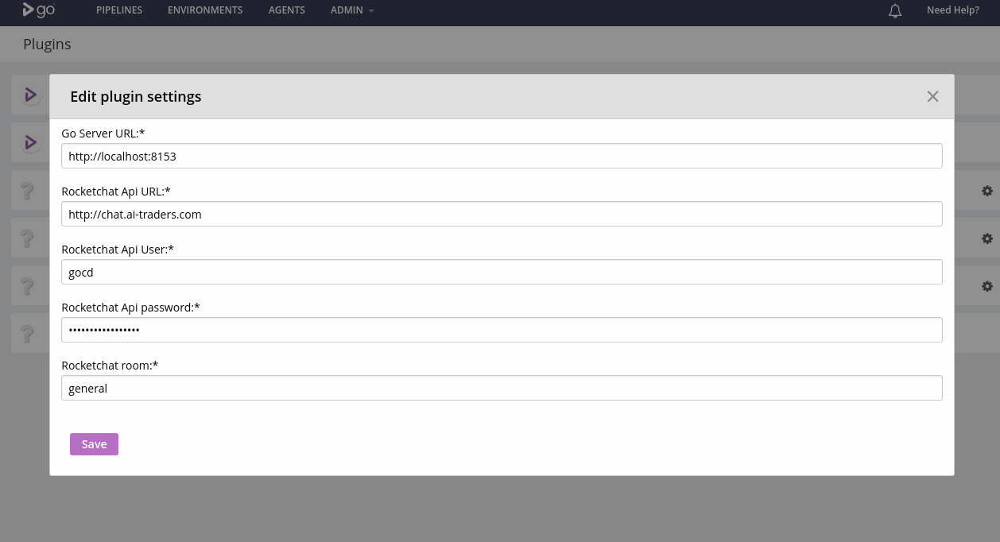

# GoCD rocketchat notification plugin

This is a notification plugin for GoCD, which sends build failures to RocketChat.



Features:
 - link to failed stage
 - label of the pipeline with link to VSM view
 - links (only) failed jobs and link to console of each

## Building the code base

To build the jar, run `./gradlew clean test jar`

## Setup

You need to install the jar on server in `plugins/external` directory.
Then you must configure access to rocketchat and room for notifications on plugin settings page.



## Configuring the plugin for GoCD on Kubernetes using Helm

### Adding the plugin
- In order to add this plugin, you have to use a local values.yaml file that will override the default [values.yaml](https://github.com/helm/charts/blob/master/stable/gocd/values.yaml) present in the official GoCD helm chart repo.
- Add the .jar file link from the releases section to the `env.extraEnvVars` section as a new environment variable.
- The environment variable name must have `GOCD_PLUGIN_INSTALL` prefixed to it.
- Example

```
env:
  extraEnvVars:
    - name: GOCD_PLUGIN_INSTALL_rocketchat
      value: https://github.com/tomzo/gocd-rocketchat-plugin/releases/download/0.1.1/gocd-rocketchat-plugin-0.1.1.jar
```
- Make sure to add the link of the release you want to use.

- Then applying the local values.yaml that has these values added to it will result in a new Go Server pod being created that has the plugin installed and running.


## Contributing

Please report bugs.
For new features PRs are most welcome.

## License

Apache License, Version 2.0
